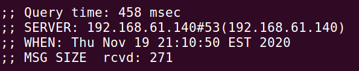
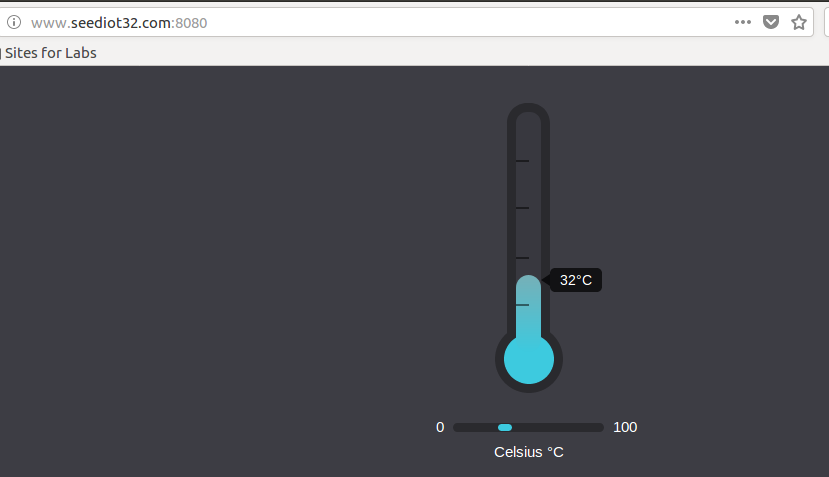
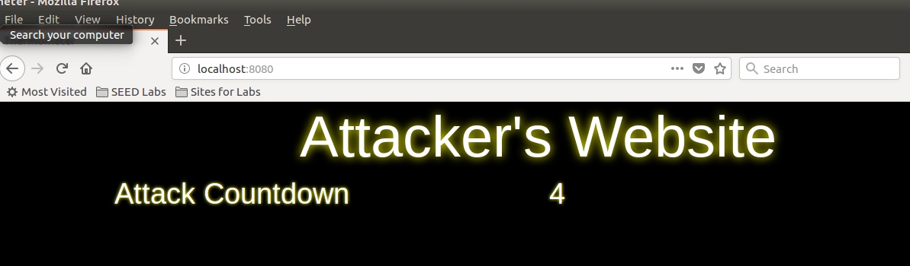
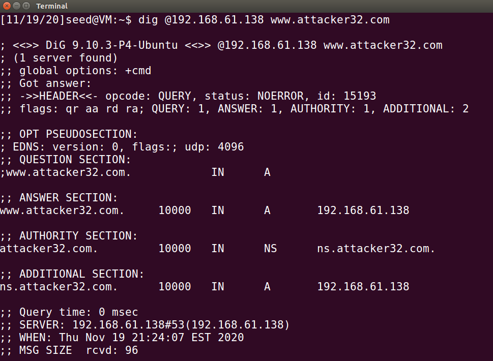
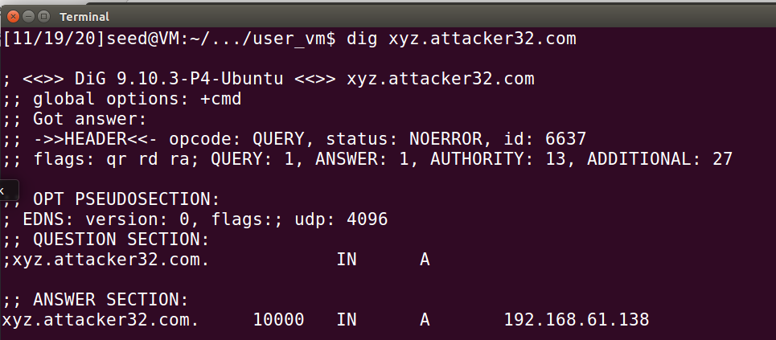
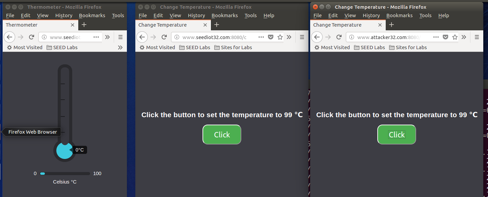

#<center>DNS Rebinding Attack Lab
<center>2018级 信息安全 管箫 18307130012</center>

##Lab Environment Setup
```
在本次实验中，我们使用三台虚拟机，ip地址分别为：
Attacker: 192.168.61.138
Victim: 192.168.61.139
DNS Server: 192.168.61.140
```

###Task 1: Configure the User VM
####Step 1. Reduce Firefox’s DNS caching time
减少火狐浏览器的DNS cache记录时间，方便进行攻击
####Step 2. Change /etc/hosts
将操控模拟IoT设备的域名指向本机ip地址
####Step 3. Local DNS Server
将本地DNS服务器指向192.168.61.140
####Step 4. Testing

观察可知本地DNS服务器设置成功

###Task 2: Start the IoT server on the User VM
####Step 1. Install Flask
安装python的web框架Flask
####Step 2. Start the IoT server
####Step 3. Testing the IoT server

我们可以从本地访问这个IoT服务器

###Task 3: Start the attack web server on the Attacker VM
####Step 1. Install Flask
安装python的web框架Flask
####Step 2. Start the attacker’s web server
####Step 3. Testing the Attacker’s web server

观察可知攻击服务器构建完成

###Task 4: Configure the DNS server on the Attacker VM

设置攻击服务器

###Task 5: Configure the Local DNS Server

成功在local DNS服务器上完成绑定

##Launch the Attack on the IoT Device
###Task 6. Understanding the Same-Origin Policy Protection
同源策略是一种约定，它是浏览器最核心也最基本的安全功能。浏览器的同源策略，限制了来自不同源的“document”或脚本，对当前“document”读取或设置某些属性。影响“源”的因素有：host（域名或IP地址，如果是IP地址则看做是一个根域名）、子域名、端口、协议。在浏览器中，许多标签都可以跨域加载资源，而不受同源策略的限制，但是浏览器限制了JavaScript的权限，使其不能读、写返回的内容。

我们可以观察到，位于seediot32.com的change网页可以正常更改温度，但位于attacker32.com的网页不行。
观察web console，我们看到以下消息：
>Cross-Origin Request Blocked: The Same Origin Policy disallows reading the remote resource at http://www.seediot32.com:8080/password. (Reason: CORS header ‘Access-Control-Allow-Origin’ missing)

可以观察到不能改变温度的原因是触发了跨域的保护机制，同源策略禁止了读跨域的资源，也即此处的password

###Task 7. Defeat the Same-Origin Policy Protection
####Step 1: Modify the JavaScript code
修改后，仍然不能跨域执行

####Step 2: Conduct the DNS rebinding
通过在网页加载之间重新解析ip地址，我们完成了攻击

###Task 8. Launch the Attack
