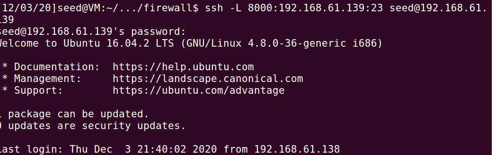

# Linux Firewall Exploration Lab

2018级 信息安全 管箫 18307130012

## Lab Environment

### Machine A

ip：192.168.61.138；mac：00:0c:29:01:41:ae

### Machine B

ip：192.168.61.139；mac：00:0c:29:a3:8a:e6

## Lab Tasks

### Task 1: Using Firewall

#### Prevent A from doing telnet to Machine B.

#### Prevent B from doing telnet to Machine A.

`iptables -I OUTPUT -p tcp -s 192.168.61.138 --dport 23 -d 192.168.61.139 -j DROP  `

`iptables -I INPUT -p tcp -s 192.168.61.139 --sport 23 -d 192.168.61.138 -j DROP`


#### Prevent A from visiting an external web site.

阻止向`www.fudan.edu.cn` 的连接：`iptables -I OUTPUT -d 202.120.224.81 -j DROP`

### Task 2: Implementing a Simple Firewall

```c
	struct iphdr *iph;
	struct tcphdr *tcph;

	char saddr[16];
	char daddr[16];

	iph = ip_hdr(skb);
	tcph = (void *)iph+iph->ihl*4;

	snprintf(saddr, 16, "%pI4", &iph->saddr);
	snprintf(daddr, 16, "%pI4", &iph->daddr);

	/* Prevent A from doing telnet to Machine B. */
	if (iph->protocol == IPPROTO_TCP && (strcmp(daddr, "192.168.61.139") == 0) && tcph->dest == htons(23)) {
		return NF_DROP;
	} 

	/* Prevent B from doing telnet to Machine A. */
	if (iph->protocol == IPPROTO_TCP && (strcmp(saddr, "192.168.61.139") == 0) && tcph->source == htons(23)) {
		return NF_DROP;
	} 

	/* Prevent A from doing ssh to Machine B. */
	if (iph->protocol == IPPROTO_TCP && (strcmp(daddr, "192.168.61.139") == 0) && tcph->dest == htons(22)) {
		return NF_DROP;
	} 

	/* Prevent B from doing ssh to Machine A. */
	if (iph->protocol == IPPROTO_TCP && (strcmp(saddr, "192.168.61.139") == 0) && tcph->source == htons(22)) {
		return NF_DROP;
	} 

	/* Prevent A from visiting www.fudan.edu.cn. */
	if (iph->protocol == IPPROTO_TCP && (strcmp(daddr, "202.120.224.81") == 0) && (tcph->dest == htons(80) || tcph->dest == htons(443)){
		return NF_DROP;
	} 
```

上述是核心hook代码。


### Task 3: Evading Egress Filtering

#### 设置阻碍

`sudo ufw deny out to 202.120.224.81 port 80`

`sudo ufw deny out to 202.120.224.81 port 443`

`sudo ufw deny out to 192.168.61.139 port 23`

按照上法设置后，观察到不能正常访问`www.fudan.edu.cn` ，也不能对VM B进行telnet。

#### Task 3.a: Telnet to Machine B through the firewall



#### Task 3.b: Connect to www.fudan.edu.cn using SSH Tunnel.

##### A1：

可以打开网页

##### A2：

不能打开。

##### A3：

再次可以打开。

##### A4：


可以观察到此时去往www.fudan.edu.cn的数据包被封装成一个个小的ssh数据包在192.168.61.138和192.168.61.140之间交换。

### Task 4: Evading Ingress Filtering

`sudo ssh -R 9000:192.168.61.138:80 seed@192.168.61.139`

`sudo ssh -R 9000:192.168.61.138:22 seed@192.168.61.139`

远程端口转发：内网主机连接到一个外网主机，在该外网主机上指定分配一个端口，使得访问指定内网ip的数据包经由该端口发送到内网主机，再由内网主机为其进行路由