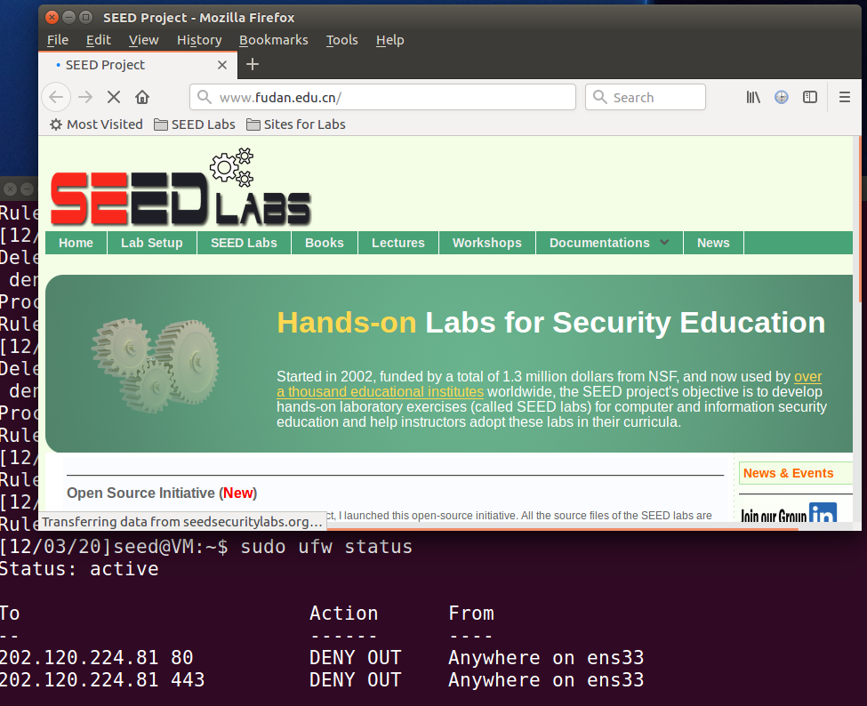
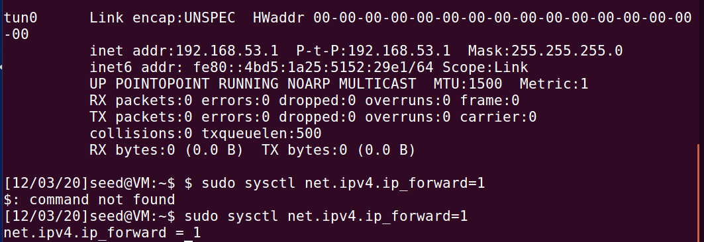
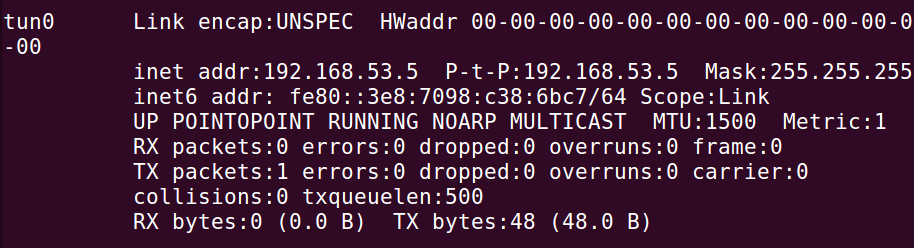
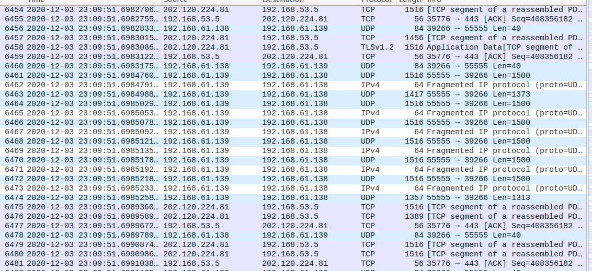

# Firewall Evasion Lab: Bypassing Firewalls using VPN

2018级 信息安全 管箫 18307130012

## Task 1: VM Setup

### VM1:

ip：192.168.61.138；mac：00:0c:29:01:41:ae

### VM2:

ip：192.168.61.139；mac：00:0c:29:a3:8a:e6

## Task 2: Set up Firewall

`sudo ufw deny out on ens33 to 202.120.224.81 port 80`

`sudo ufw deny out on ens33 to 202.120.224.81 port 443`

## Task 3: Bypassing Firewall using VPN

### Step 1: Run VPN Server

### Step 2: Run VPN Client.

### Step 3: Set Up Routing on Client and Server VMs.

#### 在Client端

`sudo route add -net 202.120.224.0/24 tun0`

### Step 4: Set Up NAT on Server VM.

#### 包路径：

对于202.120.224.81，包的通信目的ip是192.168.53.5。

而这实际上是由202.120.224.81先发到Server，Server再由192.168.53.1转发到192.168.53.5，也即Client上。