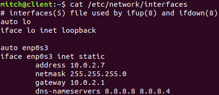

## miniVPN

This project uses Ubuntu 18.04 as the virtual machine

https://releases.ubuntu.com/18.04.4/ubuntu-18.04.4-desktop-amd64.iso


This project is following SEEDLabs VPN-labs. To execute the lab, multiple virtual machines will need to be created. The table below shows the networking table that we try to achieve.

| machine | IP |
| ------- | -- |
| client | **10.0.2.7 (NATNetwork)** |
| server | **10.0.2.8 (NATNetwork)** & **192.168.60.1 (vpnnet)** |
| target | **192.168.60.101 (vpnnet)** |

The following software versions are utilized:
* hypervsior - Virtualbox 5.2.34_Ubuntu r133883
* guest OS (client/server/target)- ubuntu-18.04.4-desktop-amd64


## VirtualBox settings

Do the following instructions through Virtualbox in order to set up the internal network between the server and the target

# 1. Create a NAT Network

* open up `File` on the top left of the VirtualBox Manager

* Open up `Network`

 \

* Press the green + icon on the top right of the window

* keep the default settings which are shown below


* press okay

# 2. Server

* open up the settings of the **server** virtual machine

* click `Network` in the left column

* Open `Adapter 2` tab on the top (Leave Adapter 1 alone for now)

* Create an internal network by changing the `Attached to:` dropdown to `Internal Network`, and then give the network a name. We used vpnnet.


* Open `Adapter 1` tab on the top

* Set Adapter 1 to `Nat Network` and choose the NAT Network we created earlier.


# 3. Target
* open up the settings of the **target** virtual machine

* click `Network` in the left column

* Open `Adapter 1` tab

* select the network we made earlier under `NAT Network`


# 4. client
* open up the settings of the **client** virtual machine

* click `Network` in the left column

* Open `Adapter 1` tab on the top (Leave Adapter 1 alone)

* Set Adapter 1 to `Nat Network` and choose the NAT Network we created earlier.


## Setting up networking inside the virtual machine
# 1. Server
Log into your server machine and on the top right click the icon to open the dropdown menu.


You will notice that there are two 'ethernet' connections, and they will most likely be different names for you. We notice there that enp0s3 is up which is the NAT network, and enp0s8 is down which is the vpnnet network.


Click the `Wired Settings` option for the second ethernet option.


You will notice that two connections again , click the cog icon to the right of enp0s8 (the adapter name may be different for you)

Follow each step:
* click the `IPv4` tab on the top

* check off `Manual` in the IPv4 Method section instead of 'Automatic(DHCP)'

* Write the following networking settings shown below, and then click apply.


Now we need to set a static IP for the client.
* Open terminal with `ctrl + alt + t`
* edit /etc/network/interfaces and **add** the following

```
auto enp0s3
iface enp0s3 inet static
        address 10.0.2.8
        netmask 255.255.255.0
        gateway 10.0.2.1
        dns-nameservers 8.8.8.8 8.8.4.4
```

and then either restart the system or execute the following:
```
$ sudo ip a flush enp0s3
$ sudo systemctl restart networking.service
```
**note**: Your adapter may be different than enp0s3. Substitute if needed.


# 2. Target
Similar to Server, set up the networking as such:


# 3. client

Just like server, let's set static IP for the NAT Network.
* Open terminal with `ctrl + alt + t`
* edit /etc/network/interfaces and **add** the following

```
auto enp0s3
iface enp0s3 inet static
        address 10.0.2.7
        netmask 255.255.255.0
        gateway 10.0.2.1
        dns-nameservers 8.8.8.8 8.8.4.4
```
Example /etc/network/interfaces is shown below



and then either restart the system or execute the following:
```
$ sudo ip a flush enp0s3
$ sudo systemctl restart networking.service
```
**note**: Your adapter may be different than enp0s3. Substitute if needed.

# Testing internal network

Test that the server can ping the target:
* press `ctrl + alt + t` to open a terminal
* type in `ping -c 2 192.168.60.101`

You should get a response


---
  
