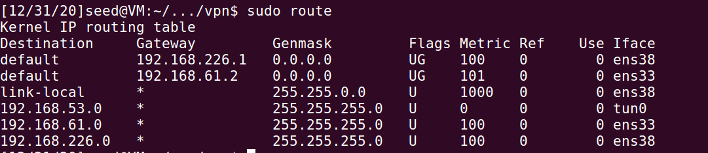
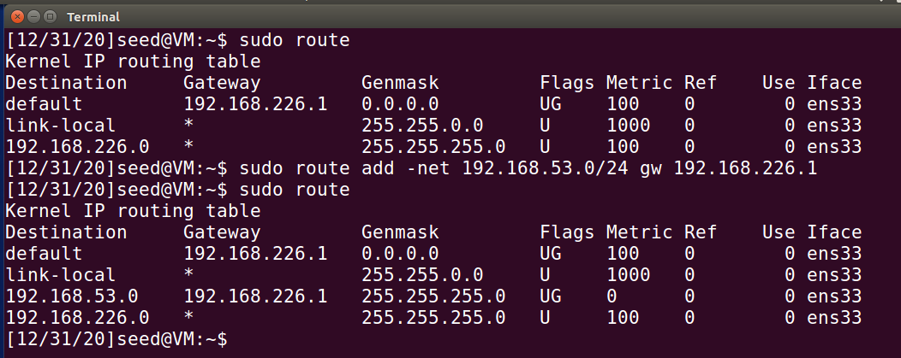

# Virtual Private Network (VPN) Lab

2018级 信息安全 管箫 18307130012

## Task 1: VM Setup

我们将需要三台虚拟机。

### Server

#### ens33（Internet)

ip : 192.168.61.138	mac ： 00:0c:29:01:41:ae

#### ens38（Internel）

ip ：192.168.226.1	mac ：00:0c:29:01:41:b8

### Host U

#### ens33（Internet）

ip ：192.168.61.139	mac ：00:0c:29:a3:8a:e6

### Host V

#### ens33（Internel）

ip ：192.168.226.101	mac ：00:0c:29:aa:55:ad 

## Task 2: Creating a VPN Tunnel using TUN/TAP

### Step 1: Run VPN Server.

### Step 2: Run VPN Client.

### Step 3: Set Up Routing on Client and Server VMs

#### server

#### client

### Step 4: Set Up Routing on Host V.

### Step 5: Test the VPN Tunnel

#### ping

#### telnet

我们可以看出，蓝色部分的UDP包是tunnel包，紫色部分的则是实际的包内容

### Step 6: Tunnel-Breaking Test.

这一部分结果同上个lab，不再赘述。

## Task 3: Encrypting the Tunnel

可以观察到传输的数据包中的证书

而实际网页被加密

## MiniVPN

