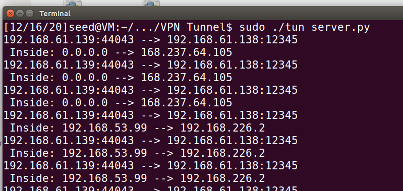

# VPN Tunneling Lab

2018级 信息安全 管箫 18307130012


## Task 1: Network Setup

我们将需要三台虚拟机。

### Server

#### ens33（Internet)

ip : 192.168.61.138	mac ： 00:0c:29:01:41:ae

#### ens38（Internel）

ip ：192.168.226.1	mac ：00:0c:29:01:41:b8

### Host U

#### ens33（Internet）

ip ：192.168.61.139	mac ：00:0c:29:a3:8a:e6

### Host V

#### ens33（Internel）

ip ：192.168.226.101	mac ：00:0c:29:aa:55:ad 

### Test

#### Host U can communicate with VPN Server


#### VPN Server can communicate with Host V


#### Host U should not be able to communicate with Host V


## Task 2: Create and Configure TUN Interface

### Task 2.a: Name of the Interface


### Task 2.b: Set up the TUN Interface


可以观察到该虚拟设备拥有了对应的ipv4和ipv6子网归属以及被启动。

### Task 2.c: Read from the TUN Interface


#### ping 192.168.53.3

程序打印出了发送的icmp包的基本信息，这是因为icmp包的目标网段在TUN的网段中，经由TUN被路由。

#### ping 192.168.60.3

程序没有输出，这是因为这个地址不属于192.168.53.99/24网段，不由程序路由。

### Task 2.d: Write to the TUN Interface

#### spoof icmp reply


#### arbitrary data


出错，程序跳出


## Task 3: Send the IP Packet to VPN Server Through a Tunnel

### The server program tun_server.py

### Implement the client program tun client.py


### Testing

#### IP address belonging to the 192.168.53.0/24

显示从Host U的外网地址向Server的外网地址的12345端口发送了包，内容是192.168.53.99向192.168.53.3的包。


#### IP address in the 192.168.60.0/24




## Task 4: Set Up the VPN Server


## Task 5: Handling Traffic in Both Directions

### ping


### telnet


### flow

应用程序（Host U）--> tun（Host U）--> ens33（Host U）--> ens33（Server）--> socket（Server）--> ens38（Server）--> ens33（Host V）--> 应用程序（Host V）--> ens33（Host V）-->ens38（Server）--> tun（Server）--> ens33（Server）--> ens33（Host U）-->socket（Host U）-->tun（Host U）-->应用程序（Host U）


## Task 6: Tunnel-Breaking Experiment

当断开tun连接时，在telnet中输入的字符将不可见。重新建立tun连接后，输入的字符将会出现。

观察wireshark抓包记录。


可以观察到在tun连接断开期间，产生了大量tcp重传。这暗示我们tcp连接并没有断开。


## Task 7: Routing Experiment on Host V


`sudo ip route add 192.168.53.0/24 dev ens33 via 192.168.226.1`


## Task 8: Experiment with the TUN IP Address

### Where are the packets dropped?

#### Server


#### Host V


可以观察到Server收到了数据并且进行了转发，Host V也收到了数据，但是并没有进行回应

#### Why are the packets dropped？

这是因为一个叫做“反向路径过滤”的机制存在。

```
The default behavior of Linux is to consider asymmetric routing suspicious and therefore to drop any packet whose source IP address is not reachable through the device the packet was received from, according to the routing table. 
——《Understanding Linux Network Internals》
```

在本案例中，Host V反向查找路由，发现收到的包的上一跳路由器和响应包所对应的默认路由器不是同一个，反向路径检查失败，所以抛弃了回应包。

### How to solve this problem?

在Host V上增加一条路由记录：

`sudo ip route add 192.168.30.0/24 via 192.168.226.1`


## Task 9: Experiment with the TAP Interface

### Ping


显示了ARP包的内容：`who has 192.168.53.6 says 192.168.53.99`。

这是因为当主机需要向某个同子网的主机发送数据包时，会广播ARP包请求该主机响应其mac地址，这样才能正确将数据包按照mac地址导向。

### Spoof ARP

#### arping -I Guan0 192.168.53.33


#### arping -I Guan0 1.2.3.4

